# SABTECH MINI ERP — USER MANUAL

## A. Cover Section

* **Product Name:** Sabtech Mini ERP
* **Version:** v0.1.0 (Based on current codebase)
* **Prepared for:** End Users, Company Admins, Super Admins, Trainers
* **Prepared by:** Sabtech Online
* **Website:** [https://minierp.sabtechonline.com](https://minierp.sabtechonline.com)
* **Support:** +256 777293933 / info@sabtechonline.com

---

## B. System Overview

Sabtech Mini ERP is a multi-company, multi-tenant SaaS Enterprise Resource Planning platform designed for solo consultants, small teams, and growing enterprises. The system serves as a central hub for business operations, client tracking, project planning, quotation generation, invoicing, payments, expense management, and financial reporting.

### Key Architectural Concepts
1. **Multi-Company SaaS Structure:** Multiple independent companies (workspaces) operate within the same platform. Users register their companies, which creates isolated workspaces.
2. **Company-Based Data Isolation:** Security is enforced at the database level using Row Level Security (RLS) policies. Every client, project, service, invoice, quotation, task, payment, and expense is bound to a specific `company_id`. Users only see data belonging to the workspace context they are currently active in.
3. **Role-Based Access Control (RBAC):** Access to modules, buttons, inputs, and settings is restricted according to user roles. System administrators can also define granular permission overrides per user.
4. **End-to-End Business Workflow:** The system enables a seamless workflow:
   * Define standard billing catalog in the **Services** module.
   * Onboard and track client portfolios under **Clients**.
   * Initiate business deals using **Quotations**, which can be approved and converted.
   * Plan operations by setting up a **Project**, creating a **Task Board** (Kanban/Gantt), and configuring **Invoice Schedules** (installments or milestones).
   * Generate and send **Invoices** automatically from schedules or manually.
   * Record client deposit settlements in **Payments** with automatic calculations.
   * Capture business operational outflows under **Expenses** linked to clients/projects.
   * Monitor financial health (revenue, collections, margin, and outstanding balances) in real-time under **Reports**.

---

## C. User Roles & Access

The platform identifies six distinct roles within a company workspace. Below is the permissions and restrictions matrix:

| Role | Access Level | Main Permissions | Restrictions |
|---|---|---|---|
| **Super Admin** | Full Company Workspace Control | Manage all company settings, configure payment gateways, manage billing subscriptions, invite/remove users, override permissions, view all projects, services, invoices, payments, expenses, and reports. | Cannot manage global platform settings (unless they are also a global Super Admin). |
| **Admin** | Full Tenant Workspace Access | Manage company settings (branding, profiles), invite users, create/edit clients, projects, services, invoices, payments, expenses, and view reports. | Cannot modify roles/permissions of Super Admins. |
| **Finance** | Financial Management & Reporting | View clients, projects, and services. Create, edit, and send invoices. Record and confirm payments. Log, review, approve, and pay expenses. Access reports. | Cannot edit company settings, branding, payment methods, or manage workspace users. |
| **Project Manager** | Operations & Project Billing | Create and edit clients, projects, and tasks. View invoices, payments, and services. Create invoices from milestone schedules. | Cannot confirm payments, reverse transactions, manage expenses, edit settings, or view financial reports. |
| **Staff** | Task Execution & Basic Logging | View assigned clients, projects, and tasks. Update task status on boards (Kanban). View services and download invoice PDFs. Log personal expenses. | Cannot create clients/projects, view general invoicing/payments lists, approve expenses, modify roles, or view reports. |
| **Client** | External Portal Access | Log into the client portal to view their own invoices, check outstanding balances, review payment receipts, and view project task updates. | Complete data isolation; cannot access any other client’s data, add services, log expenses, see settings, or access financial reports. |

---

## Module-by-Module Manual

### 1. Authentication & Account Setup

#### Purpose
Enables users to sign up, log in, reset passwords, set up their first company profile, and toggle between multiple active workspaces.

#### Who Uses This Module
All users (Super Admins, Admins, Finance, Project Managers, Staff, Clients).

#### Key Features
* User registration and email verification.
* Secure login and logout.
* Password reset request and password reset execution.
* First-time company registration onboarding wizard.
* Dynamic company switcher in the side navigation drawer.

#### Step-by-Step Usage
1. Open the application. You will land on the Welcome page.
2. Click **Sign Up** to create a new account, or **Login** if you have credentials.
3. Fill in your email address and secure password. Click Submit.
4. On first login, if you do not belong to a company, the **Onboarding Wizard** will prompt you to create a workspace. Enter your company name, physical address, country, and base currency.
5. Click **Create Workspace**. The system initializes your workspace settings, registers you as the tenant Super Admin, and loads the dashboard.
6. To switch workspaces, click your company name on the top-left sidebar. Select any alternative company from the dropdown menu, or click **Create Workspace** to add a new one.

#### Workflow Connections
Creates the initial user record (`app_users`) and workspace context (`companies`, `company_users`) required for all other actions.

#### Business Rules
* Every active user must have a verified email address.
* Access is blocked until a company workspace is selected or created.
* Switching companies triggers a complete data-context refresh.

#### Common Errors / Empty States
* **"Workspace not found"**: Visible if a user is invited but the company row was deleted. Action: Contact the inviting admin to re-send the invitation.
* **"Invalid credentials"**: Incorrect password or email. Action: Use the "Forgot Password" link on the login screen.

#### Recommended Screenshot Areas
* Login page: ``
* Company Onboarding screen: ``
* Workspace Switcher: ``

#### Workflow Diagram
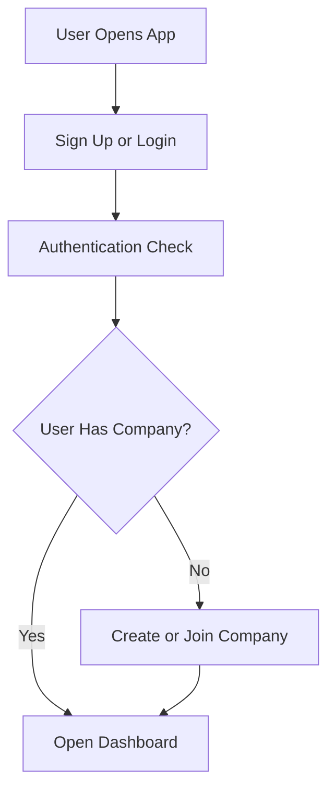

---

### 2. Company Management & Settings

#### Purpose
Allows company administrators to configure company identity, contact details, default currency, document prefixes, and branding assets.

#### Who Uses This Module
Super Admins and Admins.

#### Key Features
* Company Profile update (Name, TIN, physical address, country, currency).
* Branding asset manager (Upload logo, favicon, report logo, and select primary, secondary, and accent colors).
* Document prefixes (Invoice Prefix, Receipt Prefix, Quote Prefix).
* Default invoice footer text and payment due terms.
* PDF toggle options (Show Logo, Show TIN, Show Payment History).

#### Step-by-Step Usage
1. Go to the side navigation menu, click **Settings**, and select **Company Profile**.
2. Update the fields under **Company Identity** (Name, TIN, Registration Number, Phone, Physical Address).
3. Select the **Default Currency** (e.g., UGX, USD) and Country.
4. Click **Branding** in the settings menu to upload your company logo or favicon. Select your primary and accent colors using the color swatches or color picker.
5. Click **Invoice Settings** to customize document numbering prefixes (e.g., change `INV` to `SB-INV`) and set the default due period (e.g., `14` days).
6. Click **Save** to apply the configuration. Verify changes on the live PDF preview panel on the right.

#### Workflow Connections
* Branding details are printed on all generated invoices, quotations, and reports.
* Document prefixes determine how future invoice numbers are generated.

#### Business Rules
* Base currency cannot be changed once transactions are logged.
* Logo file size must be under 2MB. Format must be PNG, JPG, WebP, or SVG.

#### Common Errors / Empty States
* **"Setup required: Create a public Supabase Storage bucket named 'company-assets'"**: Appears in the branding section if storage integration is not complete. Action: Request platform admin to initialize storage bucket.

#### Recommended Screenshot Areas
* Company Profile view: ``
* Branding & Accent color picker: ``
* Invoice prefix configuration: ``

#### Workflow Diagram
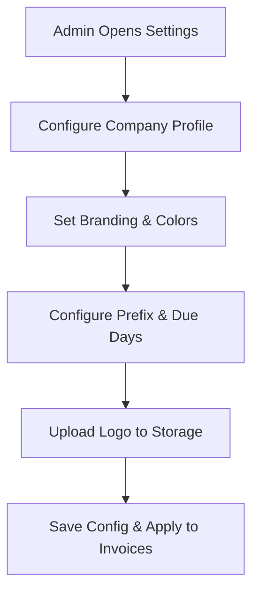

---

### 3. User & Role Management

#### Purpose
Enables company administrators to invite team members, assign access roles, and define custom permission overrides for specific modules.

#### Who Uses This Module
Super Admins and Admins.

#### Key Features
* Send email invitations.
* Revoke/cancel pending invitations.
* Set initial roles (`admin`, `finance`, `project_manager`, `staff`, `client`).
* Granular permission toggle overrides per user profile.
* Audit log tracking user actions.

#### Step-by-Step Usage
1. Go to **Admin** -> **Users** from the side menu.
2. Click **Invite User** or navigate to the **Invitations** tab.
3. Enter the email address and select the appropriate role.
4. (Optional) Set specific permission overrides (e.g., check `Allow` or `Deny` for invoice creation).
5. Click **Send Invitation**. The user receives an email link.
6. Monitor the invitation status (Pending, Accepted, Expired). You can revoke pending invites by clicking **Cancel**.
7. To edit a user's permissions, click on their name in the user list, change the overrides, and click **Save Permissions**.

#### Workflow Connections
Directly controls who can log in to the company workspace and what views they can see.

#### Business Rules
* Only Super Admins can modify other user roles to `super_admin`.
* Permission overrides take priority over the default role configuration.
* Invitations expire automatically after 7 days.

#### Common Errors / Empty States
* **"Invitation Expired"**: User clicked the invite link after 7 days. Action: Admin must click "Resend" or create a new invite.
* **"Permission Denied"**: User tries to perform an restricted action. Action: Request permission update from Admin.

#### Recommended Screenshot Areas
* User List & Invites: ``
* Invite Modal with role dropdown: ``
* Permission Overrides page: ``

#### Workflow Diagram
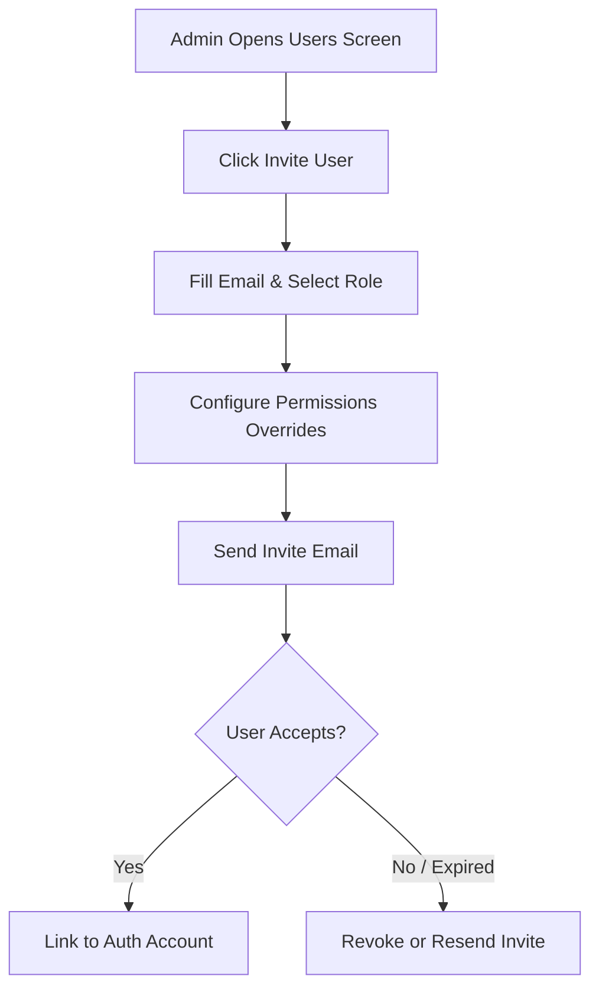

---

### 4. Services Catalog

#### Purpose
Acts as a central directory of the billing services and products offered by the company. It pre-populates unit prices and tax rates on quotation and invoice line items.

#### Who Uses This Module
Super Admins, Admins, Finance, and Project Managers.

#### Key Features
* Add new service entries with service codes, names, categories, and descriptions.
* Configure default base rates and standard tax percentages.
* Search and filter catalog by category.
* Toggle service active status (Archive/Deactivate).

#### Step-by-Step Usage
1. Go to **Services** in the sidebar.
2. Click **New Service** (or the Plus button).
3. Fill in the Service Name (e.g., "Software Consulting"), Service Code (e.g., "CONS-01"), Category, and Description.
4. Enter the Default Price and set the Tax Percentage (e.g., `18` for 18% VAT).
5. Click **Create Service**.
6. To edit a service, click the edit icon next to the service entry, update the pricing, and save.

#### Workflow Connections
Provides the billing items dropdown list when creating Quotations and Invoices.

#### Business Rules
* Service codes must be unique within the company workspace.
* Archiving a service hides it from new invoice line item selectors but preserves it on historical invoices.

#### Common Errors / Empty States
* **Empty catalog**: Displays "No services found." Action: Click "New Service" to add your first billing item.

#### Recommended Screenshot Areas
* Services List: ``
* Service Creator Dialog: ``

#### Workflow Diagram
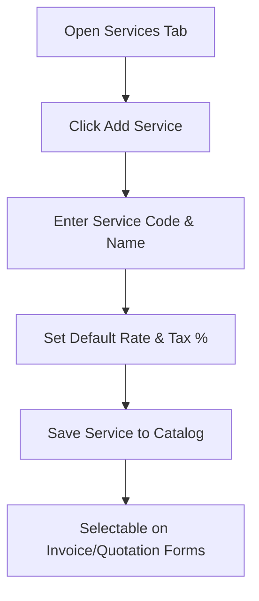

---

### 5. Client Management

#### Purpose
Enables businesses to manage client company files, contact information, billing currencies, and view outstanding balances and financial history.

#### Who Uses This Module
Admins, Finance, and Project Managers.

#### Key Features
* Onboard client company records (Client Code, Contact Person, Email, Phone, Physical Address, TIN, Base Currency).
* Real-time client outstanding balance calculations.
* Client-specific activity dashboard (Active projects, invoice history, payment ledger).
* Archive client function.

#### Step-by-Step Usage
1. Go to **Clients** in the sidebar.
2. Click **New Client** (top-right).
3. Input the Client Code, Company Name, Contact Email, Phone, Country, and Base Billing Currency.
4. Enter the client’s TIN for tax-compliant invoicing.
5. Click **Create Client**.
6. View the client in the list. Click on the client row to access their detailed panel, listing all associated projects, outstanding invoices, payments, and auditing logs.

#### Workflow Connections
Clients are associated with Projects, Quotations, Invoices, and Expenses.

#### Business Rules
* Client codes must be unique within the company.
* Client currency is locked once an invoice or project is created.
* Archiving a client hides them from new forms but retains history.

#### Common Errors / Empty States
* **"Outstanding: UGX 0"**: Client has no unpaid invoices.
* **"No active clients"**: Initial state. Action: Click "New Client" to configure your first account.

#### Recommended Screenshot Areas
* Client Directory: ``
* Client Profile Creation form: ``
* Client Details Dashboard (ledger tab): ``

#### Workflow Diagram
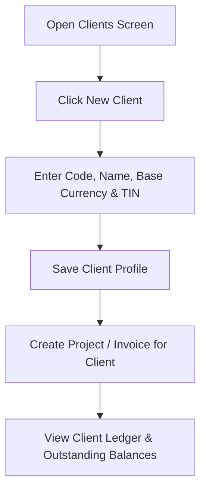

---

### 6. Quotation Module

#### Purpose
Drafts, estimates, and reviews business proposals before projects are formally started. Enables rapid conversion of approved estimates into active projects with automatic task generation.

#### Who Uses This Module
Admins, Finance, and Project Managers.

#### Key Features
* Create quotation templates with client associations, valid-until dates, and terms.
* Multi-line items table with auto-calculations (subtotal, tax, discount, totals).
* Status tracking: Draft -> Sent -> Approved/Rejected/Expired -> Converted.
* **"Convert to Project"** button that creates the project, links the client, and converts line items into project tasks.

#### Step-by-Step Usage
1. Navigate to **Quotations** in the sidebar.
2. Click **New Quotation**.
3. Choose the client, name the proposed project, and select the validity date range.
4. Add line items. Enter names, quantities, and unit rates. Subtotals and tax are computed dynamically.
5. Click **Save as Draft**.
6. Once the client reviews, click **Mark as Sent**.
7. If the client accepts, click **Approve**.
8. Click **Convert to Project** to open the project creator wizard. The system auto-fills client and description data and generates tasks from the quotation's line items.

#### Workflow Connections
Converts approved proposals directly into operational operational **Projects** and **Tasks**.

#### Business Rules
* Draft quotations cannot be converted to projects. They must follow the lifecycle: Draft -> Sent -> Approved -> Converted.
* Converted quotations are locked from edits.

#### Common Errors / Empty States
* **"Quotation Expired"**: Valid-until date has passed. Status changes to Expired. Action: Update dates or clone the quotation.

#### Recommended Screenshot Areas
* Quotation List: ``
* Add Quotation form: ``
* Quotation Detail page with Convert button: ``

#### Workflow Diagram
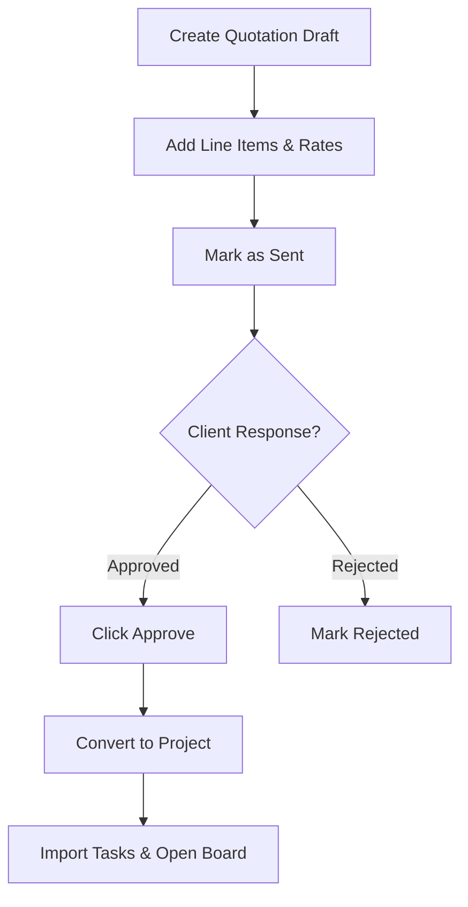

---

### 7. Project & Task Management

#### Purpose
Coordinates company project timelines, tracks tasks via Kanban/Gantt boards, assigns resources, and maps installment milestones to the billing engine.

#### Who Uses This Module
Admins, Project Managers, and Staff.

#### Key Features
* Create projects with billing models: Single Invoice, Installment, Milestone, or Recurring.
* Interactive task board (Lists, Kanban Drag-and-Drop, Gantt Timeline views).
* Staff assignments, start/end dates, estimated hours, and billable tags on tasks.
* Milestone billing schedules table (Generate invoice directly from completed milestone).

#### Step-by-Step Usage
1. Navigate to **Projects**.
2. Click **New Project** (or convert an approved quotation).
3. Assign a Client, Project Name, Manager, Budget, and select the Billing Type. Click Save.
4. Click on the project name to open the project board.
5. Go to the **Tasks** tab. Click **Add Task**, enter title, assign staff, set due date, and save.
6. Drag tasks across column lanes (Pending, In Progress, Completed, Cancelled) to update status.
7. Go to the **Billing** tab. Add installment percentages or milestone definitions.
8. When a milestone is reached, click **Generate Invoice** next to the schedule row. The invoice form launches, pre-filled with the milestone name and amount.

#### Workflow Connections
* Generates **Invoices** from milestones.
* Tracks progress updates visible to portal clients.
* Costs logged in **Expenses** can be tagged to specific projects.

#### Business Rules
* Milestone percentages must sum to 100% for installment-based projects.
* Staff roles can update task statuses but cannot delete projects or modify budgets.

#### Common Errors / Empty States
* **No tasks scheduled**: Shows "Create your first task to get started."

#### Recommended Screenshot Areas
* Projects Board Overview: ``
* Kanban Task Board: ``
* Milestone Billing Scheduler: ``
* Gantt View: ``

#### Workflow Diagram
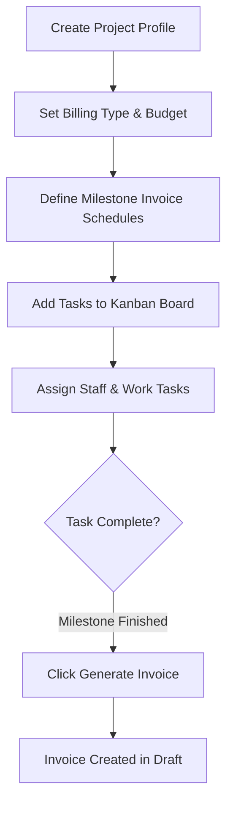

---

### 8. Invoices Module

#### Purpose
Generates, formats, and tracks tax-compliant client invoices. Handles adjustments, voids, PDF rendering, and updates outstanding client balances.

#### Who Uses This Module
Admins, Finance, and Project Managers.

#### Key Features
* Form builder with client lookup, project scope linkages, and custom due days.
* Line items with services catalog integrations, custom discount percentages, and VAT rates.
* Automatic calculations of Subtotal, Discount, Tax, Total, and Balance due.
* PDF generator with branding colors, logo, footer text, and payment instruction blocks.
* Lifecycle tracking: Draft -> Sent -> Partially Paid -> Paid / Overdue / Cancelled / Void.
* Void controls (Requires entry of reason).

#### Step-by-Step Usage
1. Go to **Invoices**.
2. Click **New Invoice** (or trigger from project billing).
3. Choose the client, select the associated project (optional), set issue date, and due date.
4. Select services in the items table. Modify quantity, price, discount %, or tax % if needed.
5. Save as **Draft**. Review the invoice preview.
6. Click **Mark as Sent** (generates document number and adds to client's outstanding balance).
7. Download PDF or print using the preview actions.
8. If the invoice was raised in error, click **Void**, type the cancellation reason, and confirm.

#### Workflow Connections
* Integrates with **Services** and **Clients**.
* Feeds directly into **Payments** (reducing balance due).
* Updates dashboard financial KPIs.

#### Business Rules
* Invoice numbers are locked after creation.
* Voiding an invoice reverses its outstanding value from client records.
* Invoices past their due date automatically switch status to **Overdue** on dashboard calendars.

#### Common Errors / Empty States
* **"Void reason required"**: Attempting to void without explaining why. Action: Enter explanation in the text input box.
* **"Balance Due: 0.00"**: Invoice has already been paid.

#### Recommended Screenshot Areas
* Invoice Dashboard: ``
* New Invoice Form: ``
* Invoice Preview Panel with PDF actions: ``

#### Workflow Diagram
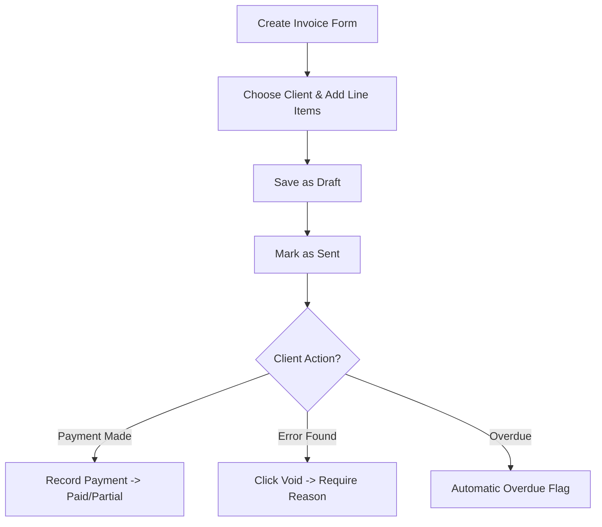

---

### 9. Payments Module

#### Purpose
Tracks client payment receipts, reconciles balances against open invoices, and manages transaction histories and payment reversals.

#### Who Uses This Module
Admins, Finance, and Project Managers.

#### Key Features
* Payment log showing Receipt Number, Date, Invoice Number, Amount, and Method.
* Multiple payment methods supported (Mobile Money, Cash, Bank Transfer, Card, Cheque).
* Payment Confirmation switch (Pending -> Confirmed).
* Payment Reversal tool (Requires reason; restores invoice balance).
* Dynamic balance reconciliation on invoices.

#### Step-by-Step Usage
1. Navigate to **Payments** in the sidebar, or click **Record Payment** from an active invoice view.
2. If recording from an invoice, the invoice number is locked. Enter the Payment Date, Amount Paid, and Method.
3. Add a Reference Number (e.g., Bank transaction hash or Momopay Tx ID) and optional notes.
4. Click **Record Payment**. The payment is created in **Pending** status (does not affect balance).
5. Review the payment details. Click **Confirm Payment** (changes status to Confirmed, reduces invoice balance, and triggers client receipt).
6. To reverse a bad transaction, click the payment row, click **Reverse**, enter the reason, and confirm. The status updates to Reversed, and the invoice balance is restored.

#### Workflow Connections
Directly reduces the `balance_due` on associated **Invoices** and clears **Clients** ledger balances.

#### Business Rules
* Reversals cannot be undone.
* You cannot record a payment amount greater than the invoice balance due.

#### Common Errors / Empty States
* **"Reversal reason required"**: Prompted when initiating a reversal.
* **"Invoice is already fully paid"**: Attempting to log a payment on a paid invoice.

#### Recommended Screenshot Areas
* Payments Directory: ``
* Record Payment Modal: ``
* Payment detail panel with Confirm / Reverse buttons: ``

#### Workflow Diagram
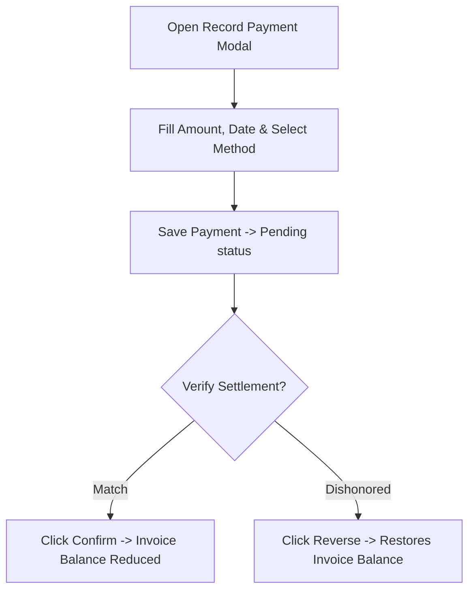

---

### 10. Expenses Module

#### Purpose
Captures and categorizes all outgoing business expenditures. Supports cost-allocation to clients/projects to track project-specific margins, and tracks receipts.

#### Who Uses This Module
Admins, Finance, and Staff (logging personal claims).

#### Key Features
* Log expenses with Category, Vendor, Date, Amount, Currency, and Description.
* Cost allocation: Link expense directly to a Client and Project.
* File Upload: Attach image/PDF receipts.
* Approval states: Pending -> Approved / Rejected -> Paid.
* Manage categories settings drawer.

#### Step-by-Step Usage
1. Go to **Expenses** in the sidebar.
2. Click **Add Expense**.
3. Select the Expense Category (e.g., "Travel", "Office Supplies"), enter the Amount, Date, and Vendor name.
4. (Optional) Associate the expense with a Client and Project.
5. Drag and drop a receipt image or PDF file to upload it.
6. Click **Save Expense** (saved as Pending status).
7. Finance/Admins review pending list. Click **Approve** or **Reject** (requires reason).
8. Once approved, click **Record Payment** to change status to Paid, logging the cash outflow.

#### Workflow Connections
Feeds outflows into the **Reports** dashboard, allowing calculation of project profit margins.

#### Business Rules
* Staff can create and view their own expenses but cannot approve or pay any expense.
* Currency default inherits from the company profile.
* Expense files are isolated by company folders in storage.

#### Common Errors / Empty States
* **Missing Category**: Categorization is required. Action: Use "Manage Categories" to create a category first.

#### Recommended Screenshot Areas
* Expenses Ledger: ``
* Add Expense Form: ``
* Category Management modal: ``

#### Workflow Diagram
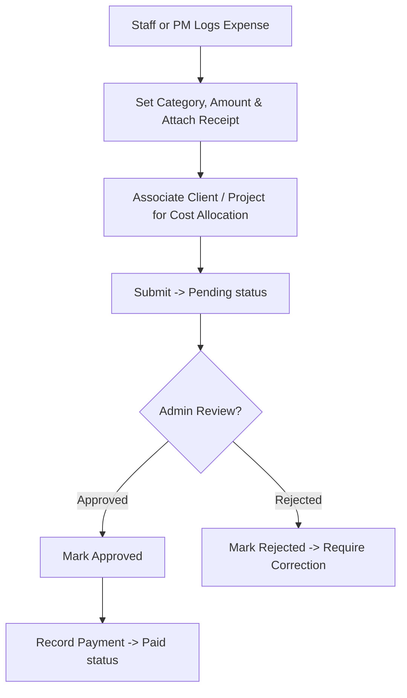

---

### 11. Reports & Analytics

#### Purpose
Consolidates operational data into high-level financial dashboards. Provides collections analysis, client billing ledgers, and status breakdowns with filter capabilities.

#### Who Uses This Module
Super Admins, Admins, and Finance.

#### Key Features
* Dynamic Date range filter (filters invoices and payments lists).
* Financial health summary KPIs (Total Invoiced, Total Collected, Outstanding balances, Overdue invoice count).
* Status Breakdown tracker (counts of draft, sent, partial, paid, overdue, void, cancelled invoices).
* Top Clients by Revenue leaderboard.
* CSV export capabilities for Invoices, Payments, and Clients data lists.

#### Step-by-Step Usage
1. Navigate to **Reports** in the sidebar.
2. Set your target start and end dates in the date selectors. The charts and numbers refresh instantly.
3. Review the KPIs in the dashboard cards.
4. Click on the tabs (**Overview**, **Invoices**, **Payments**, **By Client**) to inspect sub-ledgers.
5. Click **Export CSV** in any tab to download spreadsheet files.

#### Workflow Connections
Pulls data from Clients, Projects, Invoices, Payments, and Expenses to compile analytics.

#### Business Rules
* Voided and cancelled invoices are excluded from Total Invoiced and Outstanding calculations.
* Reversed payments are excluded from Total Collected calculations.

#### Common Errors / Empty States
* **"No data yet"**: No transactions fit the selected date range. Action: Click "Clear Filter" to view all data.

#### Recommended Screenshot Areas
* Financial Dashboard: ``
* Tab views: ``

#### Workflow Diagram
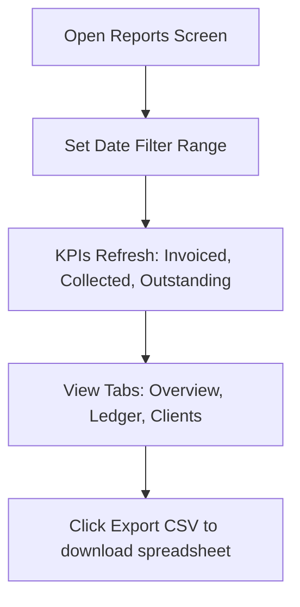

---

### 12. Billing & Subscription (SaaS Platform)

#### Purpose
Enables workspace owners to choose service plans, manage packages, view subscriptions, input payment methods, and make payments via Pesapal.

#### Who Uses This Module
Super Admins and Admins.

#### Key Features
* Package Tier Selection: Starter, Professional, Business, and Enterprise plans.
* Trial status countdown banner.
* Subscription status logs (Active, Trialing, Expired, Canceled, Suspended).
* Pesapal Integration: Pay for package renewals securely via Momopay, Card, or mobile money.
* Applied Coupons and discount values management.

#### Step-by-Step Usage
1. Navigate to **Settings** -> **Billing** in the side navigation menu.
2. View your current package status, trial end date, and user limits.
3. To upgrade or renew, select a subscription tier from the list (Starter, Professional, Business, Enterprise) and choose the billing interval (Monthly/Yearly).
4. Enter any coupon code to apply discounts, and click **Pay with Pesapal**.
5. The gateway redirects you to input Momopay Merchant code, card digits, or phone number.
6. Once complete, you return to the dashboard. The **Trial Status Banner** is removed, and plan features unlock.

#### Workflow Connections
Calculates feature limits (e.g., max invoices, max clients) dynamically during user creation and document processing.

#### Business Rules
* Exceeding the plan's invoice or client limit blocks creation forms.
* Plan key updates synchronize with RLS settings.

#### Common Errors / Empty States
* **"Package Limit Reached"**: User attempts to create a document that exceeds the plan's quota. Action: Upgrade package.

#### Recommended Screenshot Areas
* Billing Overview Panel: ``
* Package Pricing grid: ``

#### Workflow Diagram
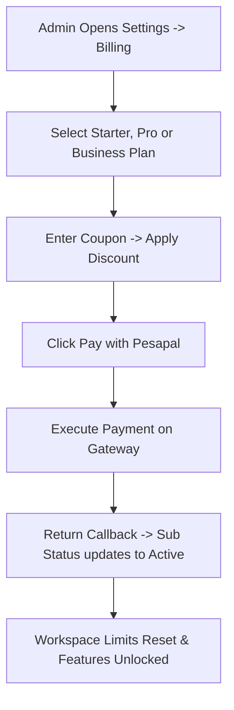

---

### 13. Super Admin Platform Module

#### Purpose
Provides global system monitoring, subscription plan configurations, company oversight, and diagnostic workspace impersonation.

#### Who Uses This Module
Platform Super Admins (Global Admins).

#### Key Features
* Impersonate Workspace: Log into any tenant workspace for troubleshooting.
* Company Directory: List all registered companies, owner emails, plans, and subscription states.
* Package Management: Define subscription keys, user/invoice limits, prices, and feature-flag arrays.
* Transactions log: Global search of all Pesapal transaction logs.
* Global Pesapal Gateway Settings setup (Consumer keys, sandbox toggle).

#### Step-by-Step Usage
1. Log in with a global administrator account. Click **Platform Admin** in the sidebar.
2. In the **Companies** panel, view details for all clients.
3. To troubleshoot a tenant's issue, click **Impersonate** next to the company row. The sidebar logo and top bar change color to indicate impersonation mode. You can now view and edit their data.
4. Click **Stop Impersonation** to return to global admin mode.
5. In the **Packages** tab, select a plan (Starter, Pro, Business) to edit limits (e.g., update Starter's invoice limit from 50 to 75). Save to update all tenant workspaces.
6. In **Platform Settings**, configure Pesapal API credentials.

#### Workflow Connections
Controls settings globally, overriding tenant configurations.

#### Business Rules
* Platform Super Admin accounts are flagged globally in `app_users.role`.
* A safety trigger prevents deletion of the last remaining active Platform Super Admin.
* Impersonation actions write to `platform_audit_logs` for compliance.

#### Common Errors / Empty States
* **"Access Restricted"**: Attempting to view platform settings without global role flags.

#### Recommended Screenshot Areas
* Platform Companies panel: ``
* Impersonation banner alert: ``
* Package limits editor: ``

#### Workflow Diagram
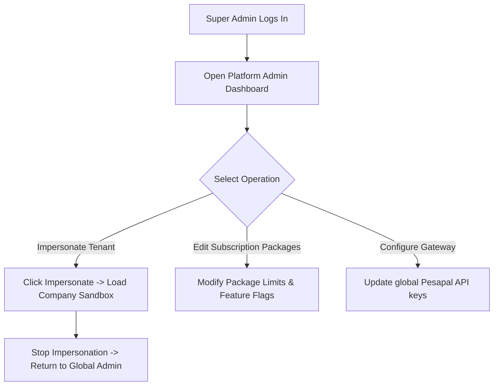

---

## E. Master End-to-End Interconnected Workflow

Sabtech Mini ERP operates as a unified workflow where tasks, estimates, billing rates, invoices, payments, and expenses flow into a single ledger to calculate profit:

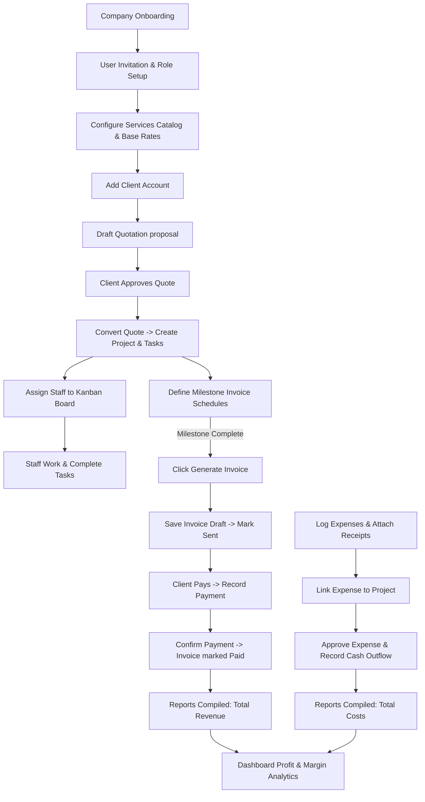

---

## F. Planned / Recommended Features Not Found in Codebase

During the review of the database schema, API functions, and application components, several features described in standard enterprise layouts were identified as **Not Found**. Below are recommendations for implementation:

### 1. Inventory Management Module
* **Expected Purpose:** Manage product warehouses, assign inventory bays, track stock levels (SKUs), log stock movements (receipt, transfer, adjustment), and set up low-stock alerts.
* **Related Module:** Inventory & Sales.
* **Recommended Implementation Priority:** **High**.
* **Rationale:** The database already contains a feature flag (`inventory.enabled`). Implementing the physical warehouse tables and stock registers will allow clients to manage physical stock alongside services.

### 2. Procurement Management Module
* **Expected Purpose:** Manage supplier directories, draft and approve Local Purchase Orders (LPOs), document Goods Receipt Notes (GRNs) on receipt, and process supplier payment transactions.
* **Related Module:** Purchases & Accounts Payable.
* **Recommended Implementation Priority:** **Medium**.
* **Rationale:** Connecting procurement directly to inventory movements will ensure that stock counts increase automatically when goods receipts are signed off.

### 3. Delivery & Logistics Module
* **Expected Purpose:** Plan delivery trips, register company vehicles and drivers, group sales orders into dispatches, and track statuses (dispatched, delivered, returned/failed).
* **Related Module:** Sales & Fulfillment.
* **Recommended Implementation Priority:** **Medium**.
* **Rationale:** A fulfillment tracking system is essential for product-centric enterprises to ensure delivery notes match confirmed invoices.

### 4. Cash Flow & Bank Reconciliation
* **Expected Purpose:** Reconcile cash/bank ledgers with incoming payment transactions, match bank statement uploads to open invoice files, and compile profit & loss balance sheets.
* **Related Module:** Finance & Accounting.
* **Recommended Implementation Priority:** **High**.
* **Rationale:** Automating payment reconciliation with bank statements reduces manual accounting errors and streamlines tax computations.
