# SABTECH MINI ERP — WORKFLOW DIAGRAMS GUIDE

This document houses all the system process flow diagrams using Mermaid syntax. It serves as a visual layout reference for business users, operation teams, administrators, and system trainers to understand how data moves through the application.

---

## 1. Authentication & Onboarding Workflow
Describes how a user accesses the system, undergoes authentication checks, and is guided to select an active company workspace or register a new one.

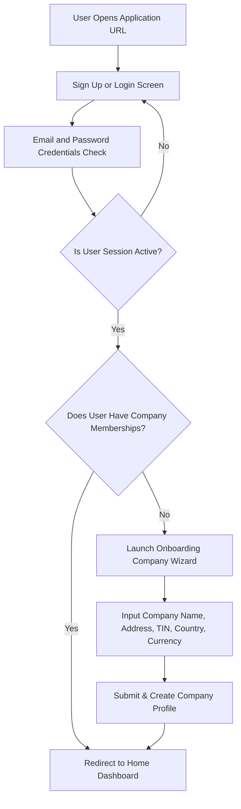

---

## 2. Company & Workspace Switcher Workflow
Shows how company settings are configured and how users who belong to multiple organizations switch their context, reloading isolated data.

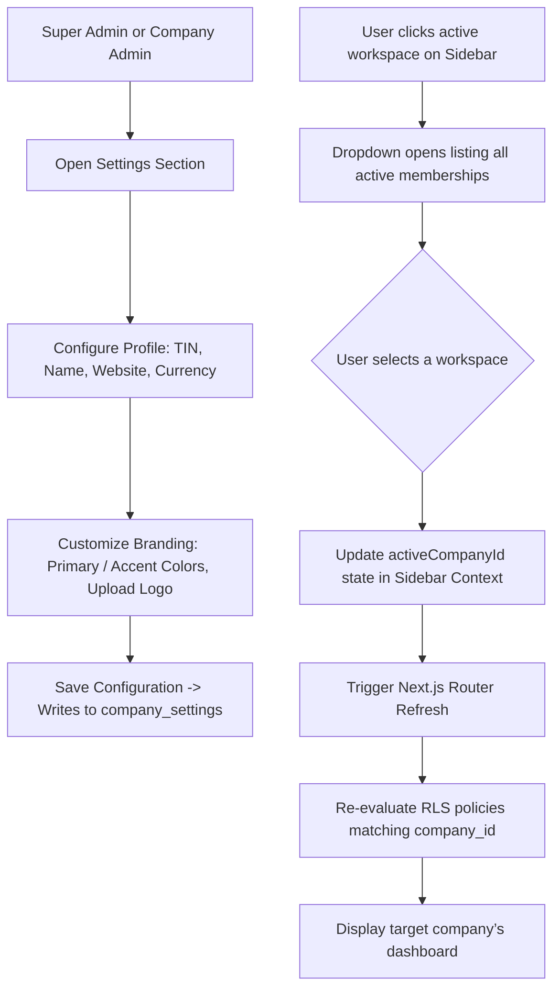

---

## 3. User Invitation & Permissions Workflow
Illustrates how Admins invite team members and set custom permission overrides that bypass standard role-based access.

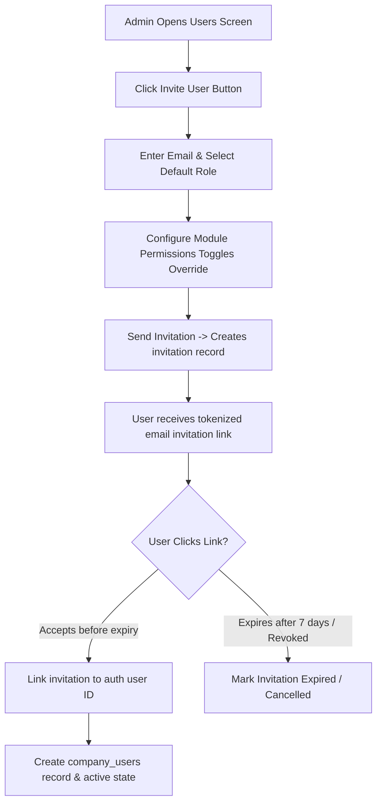

---

## 4. Services Catalog Management
Explains how the standard rates catalog is populated for quotes and invoice calculations.

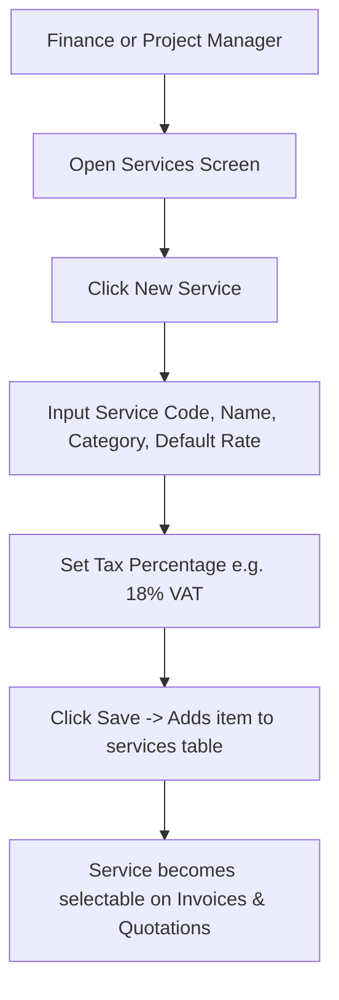

---

## 5. Quotation Lifecycle & Project Conversion
Demonstrates the pathway from an initial customer quote to project creation and automated task importing.

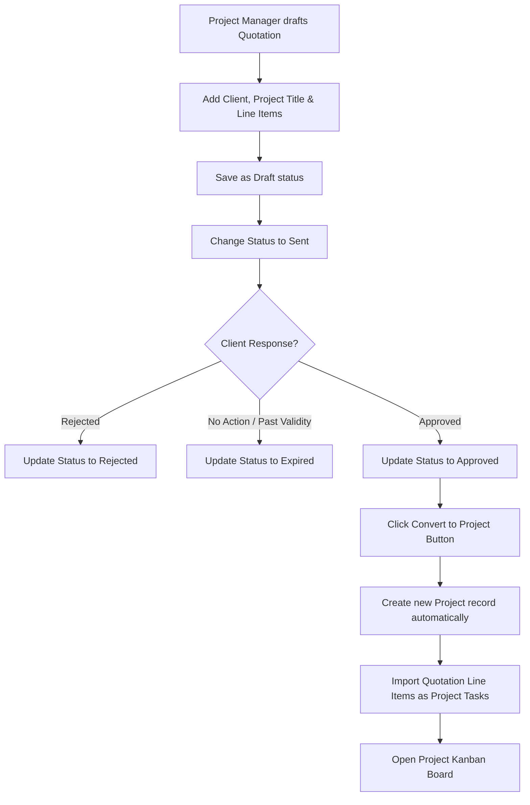

---

## 6. Project & Task Board Workflow
Shows how operations are managed via Kanban/Gantt boards and how milestones connect to the billing process.

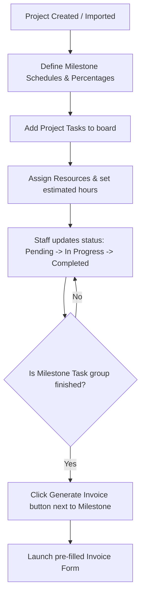

---

## 7. Invoicing Lifecycle & PDF Management
Outlines the steps required to issue invoices, compute taxes, download compliance documentation, and void invoices.

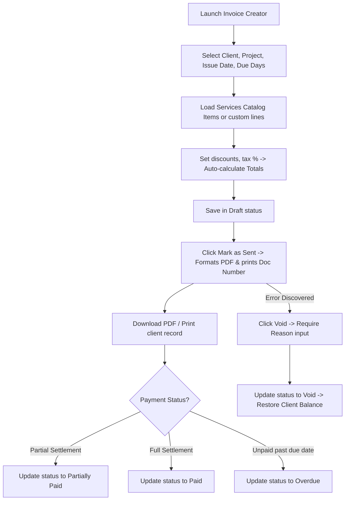

---

## 8. Payment Reconciliation & Reversal
Shows how payments are recorded against open invoice balances, reviewed, and reversed if transactions bounce.

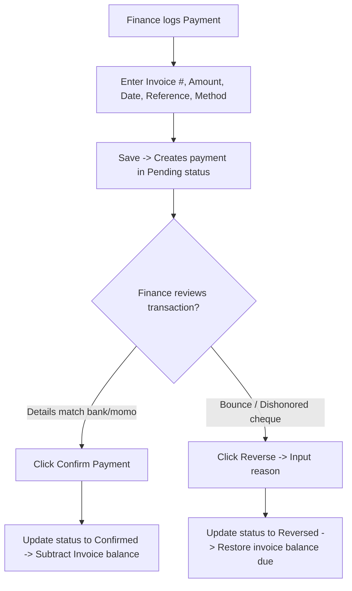

---

## 9. Expense Recording & Payout
Shows how operational costs are logged, linked to projects for margin analysis, and processed.

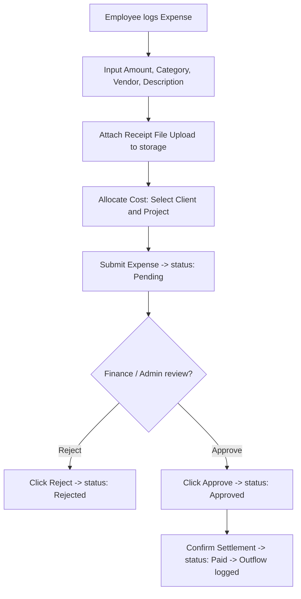

---

## 10. Reports & Financial Compilation
Explains how dashboard metrics are dynamically computed from transactions.

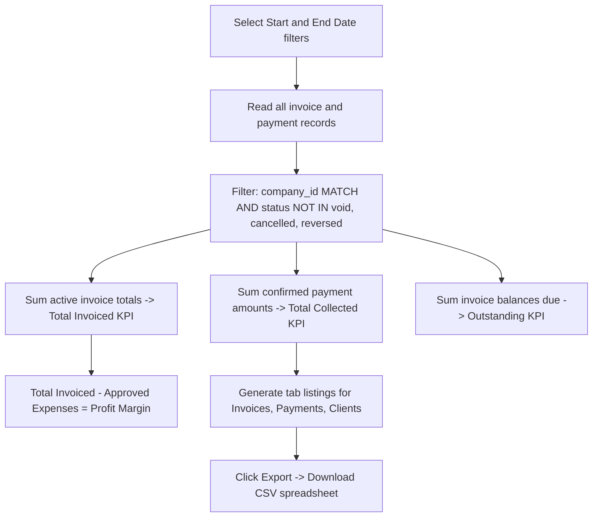

---

## 11. Billing, Subscriptions & Pesapal (SaaS)
Shows the SaaS lifecycle, checking package limitations, and integrating Pesapal.

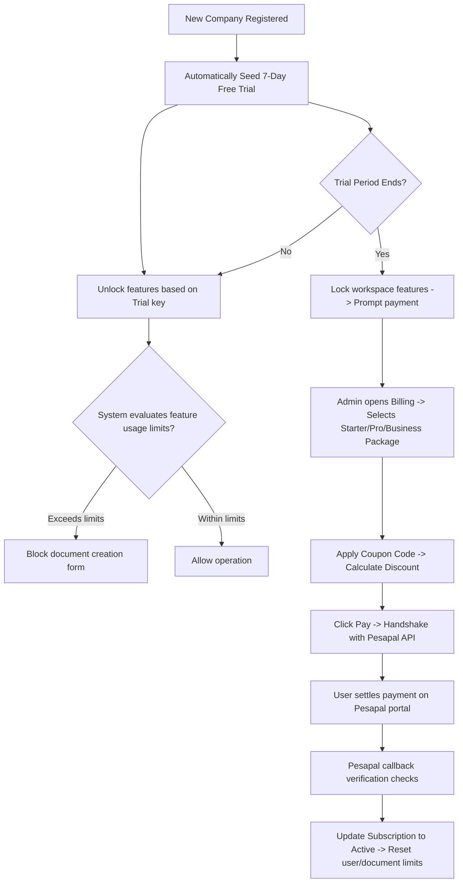

---

## 12. Super Admin Global Operations
Illustrates the global management workflows of the SaaS platform.

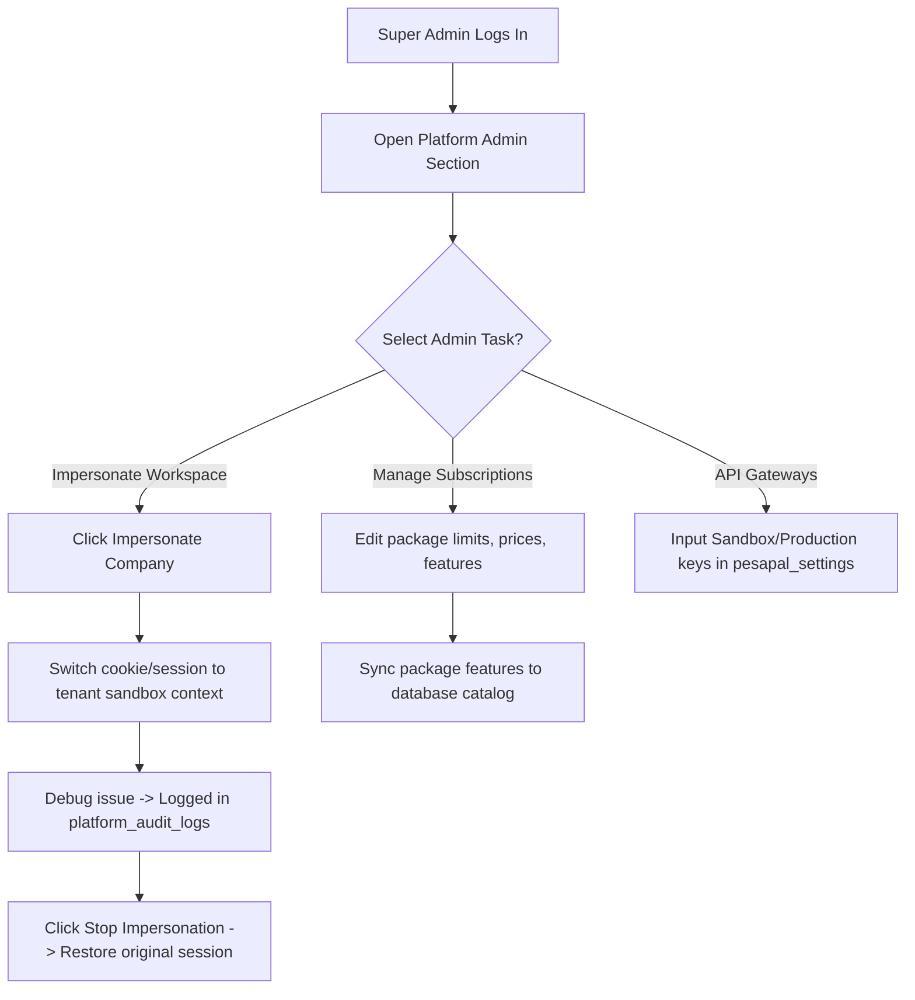

---

## 13. Master Interconnected Business Workflow
The complete, unified business flow of Sabtech Mini ERP:

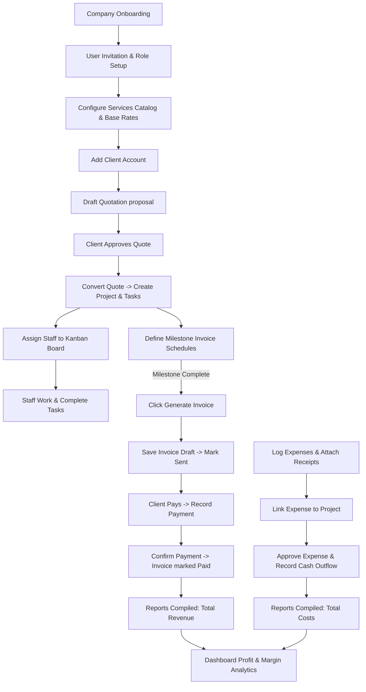
